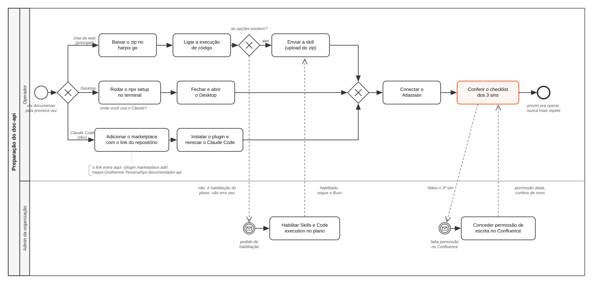
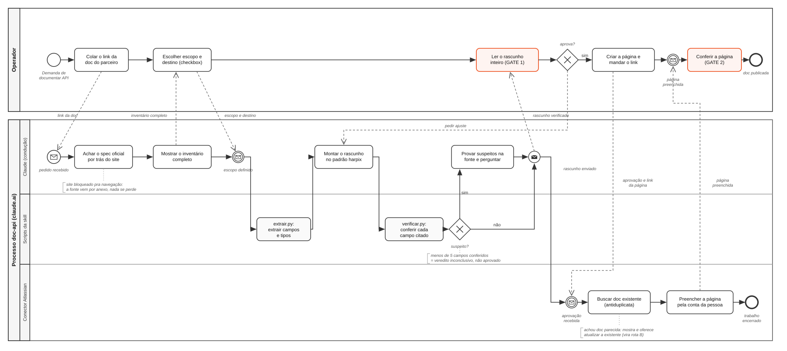

# Manual de Processos BPM, documentação de API (doc-api)

## 1. Identificação do processo

| Campo | Valor |
|---|---|
| Código do processo | PRC-DOCAPI-001 |
| Nome | Documentação de API no padrão harpix |
| Dono do processo | Guilherme Teixeira |
| Aprovador | Guilherme Teixeira |
| Versão deste manual | 1.0 |
| Data de vigência | 06/08/2026 |
| Ciclo de revisão | a cada versão nova da skill, ou no máximo a cada 6 meses |
| Público alvo | qualquer pessoa do time harpix que precise documentar API de parceiro |
| Canal oficial de execução | chat do claude.ai no navegador (principal), Claude Desktop (alternativo) e Claude Code via plugin (perfil dev) |
| Repositório do plugin | https://github.com/harpix-Guilherme-Teixeira/hpx-documentador-api |
| Documentos relacionados | manual do usuário (harpix go), este manual, a própria skill doc-api |

Este é o documento mestre do processo. Ele consolida e substitui, como referência de processo, os manuais anteriores. Se algo aqui contradiz o que alguém lembra de cabeça, vale o manual. Se a skill se comporta diferente do manual, reporte ao dono do processo: um dos dois vai ser corrigido.

## 2. Objetivo e escopo

**Objetivo.** Transformar a documentação pública de uma API de parceiro (HubSpot, VTEX, Sankhya, Bling, qualquer outra) em páginas do Confluence no padrão harpix, com todo campo, tipo e obrigatoriedade extraídos da fonte oficial por script e conferidos por código, nunca escritos de memória.

**Onde o processo começa.** No momento em que alguém do time recebe a demanda de documentar uma API (nova, atualização, cruzamento ou consulta).

**Onde o processo termina.** Com a página publicada no Confluence, revisada no gate 2, dentro da pasta correta da API.

**Entradas:**

- o link do site de documentação do parceiro, ou o arquivo do spec (OpenAPI/Swagger), ou o link de uma página do Confluence existente (no caso de atualização)
- o destino no Confluence (espaço ou página pai)
- responsável técnico, squad e prioridade da integração

**Saídas:**

- página (ou lote de páginas) publicada no Confluence, no padrão harpix de 9 seções
- opcionalmente, o PDF da documentação
- opcionalmente, relatório de cruzamento de assertividade

**Fora de escopo deste processo:** desenvolver a integração em si, negociar credenciais com o parceiro, administrar permissões do Confluence, e manter a skill (isso é processo do dono, seção 19).

## 3. Termos e definições

| Termo | O que significa neste processo |
|---|---|
| skill | o pacote `doc-api-web.zip` que se insere no claude.ai; carrega o método harpix e os scripts de extração e verificação |
| spec (OpenAPI/Swagger) | o arquivo oficial que descreve a API, campo a campo; é a fonte da verdade de toda extração |
| conector do Atlassian | a ponte oficial entre o Claude e o Confluence; publica com a conta pessoal de quem opera |
| execução de código | recurso do claude.ai que permite rodar os scripts da skill num ambiente isolado (sandbox); sem ele não existe verificação |
| anamnese | o roteiro de perguntas da skill: a sequência de decisões em múltipla escolha que conduz a pessoa da primeira mensagem até a publicação |
| rascunho | a página montada pelo Claude, ainda não publicada, aguardando o gate 1 |
| gate | ponto do fluxo em que o trabalho para e só segue com decisão humana; existem dois |
| inventário | a lista completa de endpoints do spec, mostrada antes de qualquer escolha de escopo |
| suspeito | campo citado no rascunho que o verificador não achou na fonte; vira pergunta, nunca decisão automática |
| rota | o tipo de trabalho: A documentar nova, B atualizar existente, C cruzar com leiaute, D só consultar |
| página pai (pasta) | a página do Confluence que agrupa toda a documentação de uma mesma API |
| harpix go | o portal interno da harpix; é de onde se baixa o zip da skill e onde vivem os manuais |
| Claude Code | o Claude que roda no terminal, usado por quem desenvolve; nele o doc-api se instala como plugin |
| plugin | o pacote do doc-api pro Claude Code, instalado pelo link do repositório (`/plugin marketplace add`); traz o motor e o comando `/doc-api:documentar` |
| marketplace de plugins | o catálogo de onde o Claude Code instala plugins; adicionar o link do repositório registra o catálogo da harpix |
| MCP (o motor) | o programa que dá ao Claude as ferramentas de extração e verificação no Desktop e no Claude Code; na web esse papel é dos scripts da skill |

## 4. Pré-requisitos: o que precisa estar de pé antes de operar, e por quê

Nenhuma operação começa sem esta tabela conferida. Cada requisito existe por um motivo, e conhecer o motivo evita "contornos" que quebram o processo.

| # | Requisito | Onde se confere | Por que existe |
|---|---|---|---|
| 1 | Conta claude.ai com login harpix | claude.ai, login feito | o processo roda dentro do Claude; conta pessoal fora da organização não tem as habilitações do plano |
| 2 | Execução de código LIGADA | Configurações > Recursos (Capabilities) > Code execution | os scripts de extração e verificação rodam aí; sem eles a documentação viraria memória da IA, que é exatamente o que este processo proíbe |
| 3 | Skill doc-api instalada e ativada | Configurações > Recursos > Skills | a skill é o método; sem ela o Claude não conduz a anamnese, não extrai por script e não verifica campo |
| 4 | Conector do Atlassian conectado | Configurações > Conectores, ou claude.ai/settings/connectors | é quem escreve no Confluence, com a SUA conta e as SUAS permissões; assim toda página tem autor real e auditável, e ninguém compartilha token |
| 5 | Permissão de escrita no espaço do Confluence de destino | abrir o espaço no Confluence e tentar criar página | o conector respeita a permissão da conta; sem escrita no espaço, a publicação falha por desenho, não por defeito |
| 6 | (Desktop apenas) Node 18 ou superior | `node -v` no terminal | no Desktop o motor roda como programa local e precisa do Node |
| 7 | (Claude Code apenas) plugin doc-api instalado pelo link do repositório | `/mcp` mostra o doc-api conectado | o plugin registra o motor de extração e o comando `/doc-api:documentar`; sem ele o Claude Code responde de memória, que é o que o processo proíbe |

**Requisito desejável, não bloqueante:** busca na web habilitada na organização. Com ela o Claude acha o spec sozinho por trás do site de documentação. Sem ela o processo continua funcionando pelo caminho do anexo (a pessoa baixa o spec no navegador dela e anexa na conversa), e a skill mesma oferece esse caminho.

**A regra de bolso:** requisitos 1 a 3 fazem o rascunho existir. Requisitos 4 e 5 fazem a publicação existir. Falta de 4 ou 5 nunca trava o rascunho, só adia a publicação. Os requisitos 6 e 7 valem só pra quem usa os canais alternativos (Desktop e Claude Code) e substituem, nesses canais, os requisitos 2 e 3 da web.

## 5. Visão geral do fluxo (diagramas BPMN)

O processo está modelado em notação BPMN 2.0, em dois diagramas: a **preparação** (uma vez por pessoa) e a **operação** (a cada documentação).

**Como ler a notação:** cada faixa horizontal (raia) é um responsável, e o que está dentro dela é o que aquele responsável faz. Círculo fino é onde o processo começa, círculo grosso é onde termina, círculo com envelope é uma mensagem esperada ou enviada. Retângulo é uma atividade. Losango com X é uma decisão (só um caminho segue). Linha cheia é a sequência do trabalho de um mesmo responsável; **linha tracejada é comunicação entre responsáveis diferentes** (um pedido, um link, uma aprovação cruzando a fronteira). As atividades em destaque laranja são os dois gates humanos, os pontos onde nada anda sem decisão de gente.

### 5.1 Diagrama de preparação (uma vez por pessoa)

Cobre os POPs 01 a 04. O primeiro gateway é o canal: **chat da web** (o principal, com o zip do harpix go), **Claude Desktop** (setup pelo terminal) ou **Claude Code** (o plugin, instalado pelo link do repositório). Os três caminhos convergem no conector do Atlassian e no checklist dos 3 sins. A raia do admin da organização entra só quando falta habilitação do plano ou permissão no Confluence.



### 5.2 Diagrama de operação (a cada documentação, rota A)

Duas piscinas: o **operador** (decide e aprova) e o **processo doc-api dentro do claude.ai**, este com três raias: o Claude (conduz e redige), os scripts da skill (extraem e conferem) e o conector do Atlassian (busca duplicata e preenche a página). A divisão é fixa: script extrai e confere, Claude conduz e redige, pessoa decide e aprova. Ninguém digita tabela de campo na mão, e nada é publicado sem os dois gates.



Em texto, o caminho feliz da rota A: o operador cola o link da doc, o Claude acha o spec, devolve o inventário completo, o operador escolhe escopo e destino, os scripts extraem, o Claude monta o rascunho, os scripts verificam campo a campo, suspeito vira pergunta com prova, o rascunho verificado sobe pro gate 1, aprovado o conector busca duplicata e preenche a página criada pelo operador, e o gate 2 fecha o ciclo na página publicada. As rotas B, C e D (seção 14) reaproveitam os mesmos blocos com entradas diferentes.

## 6. POP 01, obter os arquivos e o repositório

**Objetivo:** ter em mãos o pacote da skill e saber onde mora a fonte de tudo.
**Quem executa:** o operador (arquivos) e o dono do processo (repositório).

**Passo a passo do operador:**

1. Entre no harpix go e abra a página do **doc-api**.
2. Baixe o arquivo **`doc-api-web.zip`**. Guarde na pasta Downloads mesmo.
3. **Não descompacte.** O Claude recebe o zip fechado, do jeito que baixou.
4. Baixe também, se quiser consultar offline, os PDFs dos manuais que estão na mesma página.

**O que é esse zip:** a skill inteira, com o método de documentação da harpix e os dois scripts que impedem campo inventado (o extrator e o verificador). Quando sai versão nova, o go avisa e o caminho é o mesmo: baixar e inserir de novo (removendo a versão antiga antes).

**Sobre o repositório (informação de manutenção, o operador não precisa dele):** o código vive no repositório público do plugin, https://github.com/harpix-Guilherme-Teixeira/hpx-documentador-api. A pasta `skill-web/` contém a skill que gera o zip e os manuais. O motor em TypeScript (pacote npm `hpx-doc-api-mcp`, usado pelo Claude Desktop e pelo plugin de Claude Code) vive em https://github.com/harpix-Guilherme-Teixeira/hpx-mcp-docapi. Quem mantém é o dono do processo; operador nunca clona repositório pra trabalhar, o zip do go é a única fonte de instalação.

**Resultado esperado:** `doc-api-web.zip` na sua máquina, íntegro, versão mais recente do go.

## 7. POP 02, instalar no claude.ai (web), o caminho principal

**Objetivo:** deixar o claude.ai do navegador pronto pra documentar.
**Quem executa:** o operador, uma única vez por conta.
**Pré-requisito:** POP 01 concluído.

1. Abra **claude.ai** no navegador e faça login com a conta harpix.
2. Clique no avatar (canto inferior esquerdo) e abra **Configurações** (Settings).
3. Na seção **Recursos** (Capabilities), confira que **Execução de código** (Code execution) está **ligada**. Sem ela os verificadores não rodam e a skill avisa que está manca.
4. Na mesma área, em **Skills**, clique em **Enviar skill** (Upload skill) e selecione o `doc-api-web.zip`.
5. Confirme que a skill **doc-api** aparece na lista, ativada.
6. Siga pro POP 04 (conector do Atlassian), que completa a instalação.

**Resultado esperado:** skill doc-api listada e ativada, execução de código ligada.

**Se der errado:**

| Sintoma | Causa | Ação |
|---|---|---|
| Não existe a opção Skills ou Code execution | habilitação do plano da organização | não é erro seu; fale com o dono do processo, a habilitação é feita pela administração em minutos |
| O upload do zip é rejeitado | zip corrompido ou versão antiga com defeito conhecido de compactação | baixe de novo do go; persiste, reporte ao dono do processo |
| A skill aparece mas não dispara na conversa | skill desativada na lista | Configurações > Skills, ative; persiste, remova e insira de novo |

## 8. POP 03, instalar no Claude Desktop ou no Claude Code, os caminhos alternativos

**Objetivo:** deixar o Claude Desktop (quem prefere o app ao navegador) ou o Claude Code (perfil dev, na variante ao fim deste POP) pronto pra documentar.
**Quem executa:** o operador, uma única vez por máquina.
**Pré-requisito:** Node 18 ou superior instalado (`node -v` no terminal confirma; se faltar, instalador LTS em nodejs.org, e em máquina gerida abra chamado pro TI pedindo "instalação do Node.js LTS").

1. Abra um terminal (no Windows, procure "PowerShell" no menu iniciar).
2. Rode:
    ```
    npx -y hpx-doc-api-mcp@latest setup
    ```
3. O instalador pergunta seu nome (telemetria interna, uma vez só) e registra o motor no Desktop sozinho.
4. **Feche e abra o Claude Desktop.** Ele só lê a configuração na abertura, sem reiniciar o motor não aparece.
5. Confira no ícone de ferramentas da conversa que o **doc-api** aparece.
6. Conecte o Atlassian no Desktop: Configurações > Conectores > Atlassian > Conectar, login no navegador com a conta harpix (mesmo POP 04).

**Resultado esperado:** doc-api listado nas ferramentas do Desktop, Atlassian conectado.

**Diferenças em relação à web que o operador deve saber:** no Desktop o motor é um programa local que se atualiza sozinho em segundo plano (pode levar duas aberturas pra versão nova valer). Na dúvida sobre qual caminho usar, use a web: é o canal principal, recebe as melhorias primeiro e não depende de nada instalado.

### Variante Claude Code: instalar o plugin pelo link do repositório

Pra quem trabalha no terminal com o Claude Code (perfil dev). É aqui que o **link do repositório do plugin** entra: ele é o argumento do comando de marketplace.

1. Abra o Claude Code no terminal (comando `claude`).
2. Adicione o marketplace do plugin, **colando o link do repositório** no comando:
    ```
    /plugin marketplace add harpix-Guilherme-Teixeira/hpx-documentador-api
    ```
    O comando aceita os dois formatos: o atalho `dono/repositório` (como acima) ou o link completo, https://github.com/harpix-Guilherme-Teixeira/hpx-documentador-api. É o mesmo repositório da seção 1, e esse é o único lugar do processo onde esse link é digitado.
3. Instale o plugin:
    ```
    /plugin install doc-api@hpx-documentador-api
    ```
4. **Feche e abra o Claude Code.** A parte de conversa carrega na hora, mas o motor (o MCP) só conecta na abertura; sem reiniciar o Claude responde manco, sem as ferramentas de extração.
5. Confira com `/mcp` que o **doc-api** aparece conectado (aparece como `doc-api` ou `plugin:doc-api:doc-api`) e conecte o **Atlassian** na mesma tela (POP 04).

**Gotcha conhecido:** quem instalou antes pelo comando antigo (`npx -y hpx-doc-api-mcp setup`) tem um registro que **esconde** o do plugin. Remova com `claude mcp remove doc-api -s user` e reinicie; fica só o do plugin, que se atualiza sozinho.

**Resultado esperado:** plugin instalado, doc-api conectado no `/mcp`, comando `/doc-api:documentar` disponível.

## 9. POP 04, configurar o conector do Atlassian

**Objetivo:** dar ao Claude o poder de ler e escrever no Confluence **com a sua conta**.
**Quem executa:** o operador, uma única vez por conta.

**Por que este conector é obrigatório, e por que é assim:** toda publicação sai pela conta de quem opera. Isso garante três coisas: a página tem autor de verdade (auditoria), a permissão respeitada é a da pessoa (segurança), e ninguém compartilha credencial (nunca se digita token de API do Confluence em lugar nenhum; se alguém te mandar um token, não use e avise o dono do processo).

**Na web (claude.ai):**

1. Abra **claude.ai/settings/connectors** (ou Configurações > Conectores).
2. Localize **Atlassian** e clique em **Conectar**.
3. O navegador abre o login do Atlassian: entre com a conta harpix e **autorize**.
4. De volta ao Claude, o conector aparece como conectado.

**No Desktop:** Configurações > Conectores > Atlassian > Conectar, mesmo login.

**Quem já usa o Atlassian no Claude** (pro Jira, por exemplo) não precisa fazer nada, é o mesmo conector.

**Resultado esperado:** conector Atlassian conectado. Teste rápido: numa conversa nova, peça "busca no Confluence a página X" com uma página que você conhece; voltou resultado, está de pé.

**Manutenção:** a sessão do conector expira de tempos em tempos. O sintoma é erro na hora de publicar ou de buscar. A ação é sempre a mesma: Configurações > Conectores, conectar de novo. A própria skill confere o conector no início de cada trabalho e avisa com o atalho certo se estiver caído, sem travar o rascunho.

## 10. POP 05, iniciar uma documentação e passar a rota da API

**Objetivo:** entregar ao Claude a fonte certa da API, do jeito que o processo aceita.
**Quem executa:** o operador, a cada trabalho.

**O princípio:** você nunca digita campo, tabela ou comando. As únicas coisas que você fornece são **links** e, quando preciso, **anexos**. Todo o resto é decidido respondendo perguntas de múltipla escolha com o número da opção.

**Passo a passo:**

1. Abra uma **conversa nova** no claude.ai (uma conversa por API documentada, isso mantém o contexto limpo).
2. Diga o que precisa, do seu jeito, **já colando o link** do site de documentação do parceiro. Exemplos que funcionam:
    - "quero documentar essa API: https://developers.exemplo.com/docs"
    - "documenta o endpoint de criar pedido: https://developer.parceiro.com.br/reference/pedidos"
    - "atualiza a doc dessa API no Confluence, a página é <link da página>"
3. O Claude procura o spec oficial (OpenAPI) por trás do site e **confirma com você o que achou**: "Achei <nome da API>, N operações. É essa?". Confirme ou mande outro link.
4. A partir daí a skill conduz: inventário completo, escopo, destino, cabeçalho, extração, rascunho, verificação, gates.

**As três formas de passar a fonte, na ordem de preferência:**

| Forma | Quando usar | Como |
|---|---|---|
| Link do site de documentação | sempre que existir; é o caminho padrão | cole o link na primeira mensagem |
| Arquivo do spec em anexo | quando o Claude avisar que o site está bloqueado pra navegação dele | abra o site no SEU navegador, baixe o `openapi.json` ou `swagger.json` (costuma ter link na própria página da doc) e anexe na conversa; a extração e a verificação continuam automáticas, nada se perde |
| URL direta do spec ou conteúdo colado | quando você já tem a URL crua do arquivo, ou o parceiro mandou o spec por e-mail | cole a URL ou o conteúdo quando a skill oferecer as opções |

**API sem spec nenhum** (documentação só em HTML, caso Sankhya): a skill avisa na cara e o modo manual só segue com a sua decisão explícita, sabendo que a conferência de campo vira responsabilidade sua, campo a campo. Não é o caminho normal e a skill não entra nele calada.

**Resultado esperado deste POP:** fonte confirmada pelo Claude ("achei X, N operações") e o inventário completo de endpoints na tela pra você escolher o escopo.

## 11. POP 06, passar o destino no Confluence (a rota da pasta)

**Objetivo:** dizer ao Claude exatamente onde a documentação vai morar.
**Quem executa:** o operador, uma vez por trabalho.
**Quando acontece:** cedo no fluxo. A skill pergunta o destino logo depois do escopo, de propósito, pra publicação não virar improviso no fim.

**Como copiar o link certo no Confluence:**

1. Abra o Confluence e navegue até a **página pai** da API (a "pasta", ver POP 07). Se ela ainda não existe, navegue até o espaço onde ela vai ser criada.
2. Com a página aberta, copie o link pelo botão **Compartilhar > Copiar link**, ou copie direto a URL da barra do navegador. Os dois formatos servem:
    - `https://harpix.atlassian.net/wiki/spaces/<ESPACO>/pages/<numero>/<Titulo>`
    - link curto do botão compartilhar
3. Cole o link na conversa quando a skill perguntar "onde isso vai morar no Confluence?".

**O que a skill faz com esse destino:**

- guarda e **não pergunta de novo** na hora de publicar
- antes de criar página nova, **busca se já existe** doc daquela API ou daquele endpoint no Confluence; se achar algo parecido, mostra e pergunta se você prefere atualizar a existente (vira rota B) em vez de criar duplicata
- na publicação, cria a página **dentro da página pai** que você indicou

**A regra de publicação que não muda:** quem cria a página é **você**, publicada, nunca em rascunho (draft não aparece na busca e ninguém acha). Você cria, manda o link, e o Claude preenche pela sua conta. Depois vem o gate 2.

**Se você não sabe o destino:** escolha a opção "ainda não, decidimos na hora de publicar" que a skill oferece. O trabalho segue e a pergunta volta antes da publicação. Na dúvida sobre qual espaço usar, pergunte ao dono do processo, não crie espaço novo por conta.

## 12. POP 07, organizar a pasta de uma API no Confluence

**Objetivo:** manter a documentação de cada API achável, sem duplicata e com cara de biblioteca, não de gaveta.
**Quem executa:** o operador que publica a primeira página da API cria a estrutura; os seguintes seguem a estrutura que já existe.

**A estrutura padrão, três níveis:**

```
Espaço de documentação de integrações
└── <Plataforma>                          (página pai, a "pasta" da API)
    ├── <Plataforma> <Recurso A>          (uma página por recurso ou endpoint)
    ├── <Plataforma> <Recurso B>
    └── <Plataforma> <Recurso C>
```

**Regras da estrutura:**

1. **Uma página pai por plataforma.** "VTEX", "Sankhya", "HubSpot", "Bling". É ela que você passa como destino no POP 06. Tudo daquela plataforma mora embaixo dela.
2. **A página pai é um índice, não um depósito.** Ela carrega: uma linha do que é a plataforma, o link da documentação oficial, a tabela de códigos de erro gerais da plataforma quando existir (assim as páginas filhas referenciam em vez de repetir), e a lista das páginas filhas com uma linha de descrição cada.
3. **Uma página filha por recurso documentado**, nomeada `<Plataforma> <Recurso>`: "VTEX Catalog", "Sankhya NF-e", "HubSpot Contacts". Casos com sub produto mantêm o prefixo: "VTEX B2B Orders". Nunca nomeie só "Pedidos" ou "Contatos", o nome precisa carregar a plataforma porque a busca do Confluence mostra títulos soltos.
4. **Endpoint versus recurso:** o normal é uma página por recurso (o grupo de endpoints de contatos, por exemplo) quando os endpoints compartilham autenticação e regras. Endpoint com regra de negócio pesada e própria (uma cobrança, uma emissão fiscal) merece página só dele. Na dúvida, a skill propõe o agrupamento na hora do inventário e você decide.
5. **Nunca criar segunda pasta pra mesma plataforma.** Antes de criar página pai nova, busque no Confluence pelo nome da plataforma. A skill também faz essa busca antiduplicata, mas a primeira barreira é você.
6. **Atualização acontece na página que existe** (rota B), nunca em página nova de mesmo assunto. Página duplicada é o defeito mais caro de achar depois.

**Resultado esperado:** qualquer pessoa do time acha a doc de qualquer endpoint em dois cliques: pasta da plataforma, página do recurso.

## 13. POP 08, revisar e aprovar: os dois gates

**Objetivo:** garantir que nada chega ao Confluence sem leitura humana de verdade.
**Quem executa:** o operador (sempre) e um par revisor (recomendado).

**Gate 1, o rascunho.** O Claude mostra o rascunho inteiro, já verificado por script, e para. Este é o momento de ler de verdade, com o checklist do que a máquina **não** confere:

1. As descrições dos campos fazem sentido no nosso contexto?
2. As regras de negócio e as Regras de Ouro estão certas?
3. Os assassinos silenciosos deste endpoint estão destacados? (PUT destrutivo, retry que duplica cobrança, reserva que trava recurso, erro que só aparece em outro lugar, 400 mudo por formato, produto que precisa estar ativo, domínio diferente do resto da API)

A máquina garante que nenhum campo foi inventado. Só você sabe se a documentação está **certa**. Aprovou, pediu ajuste ou cancelou, sempre pelas opções numeradas.

**Gate 2, a página publicada.** Depois que o Claude preenche a página, abra ela no Confluence e confira as tabelas renderizadas (tabela quebrada na renderização é defeito comum de página web). De preferência, um par técnico lê também, principalmente descrição e regra de negócio.

**Em trabalho de lote (API inteira):** cada página tem seu próprio gate 1, o lote fecha de 5 em 5 páginas, e no fim de cada lote a skill mostra o placar do inventário (o que já foi, o que falta) pra você decidir se segue. O que fica sem documentar fica de fora **por decisão sua**, nunca por omissão.

## 14. Casos de uso

**CU-01, documentar um recurso novo (o caso mais comum).**
Contexto: o time vai integrar com a API de contatos da HubSpot.
Caminho: conversa nova, "quero documentar a API de contatos da HubSpot: <link>". A skill acha o spec (ou pede anexo), mostra o inventário completo, você escolhe o recurso Contacts, cola o destino (página pai "HubSpot" no Confluence), responde responsável, squad e prioridade, e o fluxo roda: extração, rascunho, verificação, gate 1, publicação, gate 2.
Resultado: página "HubSpot Contacts" publicada na pasta da HubSpot.

**CU-02, documentar a API inteira em lotes.**
Contexto: parceiro novo, o time quer a API toda documentada.
Caminho: igual ao CU-01, escolhendo "API inteira" no escopo. A skill propõe a ordem (operações de escrita e mais usadas primeiro) e trabalha em lotes de 5 páginas, cada uma com seu gate 1. No fim de cada lote, o placar do inventário e a decisão de seguir ou parar.
Resultado: a pasta da plataforma povoada página a página, com você no controle do ritmo.

**CU-03, atualizar uma doc que já existe (rota B).**
Contexto: o parceiro mudou a API, ou alguém achou erro na página.
Caminho: conversa nova, "atualiza essa doc: <link da página do Confluence>". A skill lê a página, acha a fonte oficial citada nela, reextrai do spec e apresenta a diferença em 3 grupos: mudou no spec, está errado na página, falta na página. Você aplica tudo, escolhe item a item, ou fica só com o relatório. A atualização acontece **na mesma página**, nunca em página nova.
Resultado: página atualizada, histórico de versão do Confluence preservado.

**CU-04, cruzar a API com um leiaute (rota C).**
Contexto: saber se a API do parceiro cobre o leiaute de um cliente (assertividade de integração).
Caminho: "cruza essa API com esse leiaute", com o link da API e o arquivo do leiaute. A extração dos campos da API é automática; a classificação de cada campo do leiaute pela **origem do dado** (cadastro, regra ou config, transação, calculado, gerado) é feita em conjunto, bloco a bloco, porque cruzar por nome de campo não funciona (os nomes nunca coincidem).
Resultado: entrega em 3 camadas: cobertura estrutural, assertividade de negócio, gaps de payload acionáveis. Vira página no Confluence se você quiser.

**CU-05, só entender uma API, sem publicar (rota D).**
Contexto: avaliar um parceiro antes de fechar, responder uma dúvida técnica.
Caminho: "essa API aguenta X? <link>". A skill acha a fonte, extrai e responde direto dela, sem rascunho e sem Confluence. No fim, oferece transformar em documentação aproveitando o que já extraiu.
Resultado: resposta fundamentada na fonte, zero burocracia.

**CU-06, o site da doc está bloqueado pra navegação do Claude.**
Contexto: o Claude avisa que não alcançou o site (acontece com alguns domínios).
Caminho: não é beco sem saída e não é modo manual. Abra o site no seu navegador, baixe o arquivo do spec (openapi.json ou swagger.json) e anexe na conversa. A extração e a verificação continuam automáticas, idênticas.
Resultado: mesmo fluxo, mesma qualidade, um passo manual a mais (o download).

**CU-07, API sem OpenAPI (caso Sankhya).**
Contexto: a documentação do parceiro é só HTML, não existe spec.
Caminho: a skill avisa explicitamente que sem spec não existe verificação automática, e o modo manual só segue com a sua decisão. Cada campo é conferido na mão contra a página oficial antes do gate 1, e a revisão do par vira obrigatória na prática.
Resultado: doc publicada com atenção redobrada, e o manual da página deixa claro qual foi a referência de conferência.

## 15. Papéis e responsabilidades (matriz RACI)

R executa, A responde pelo resultado, C é consultado, I é informado.

| Atividade | Operador | Par revisor | Dono do processo | Admin da organização |
|---|---|---|---|---|
| Instalar a skill na própria conta (POP 02/03) | R, A | | C | |
| Habilitar Skills e Code execution no plano | I | | C | R, A |
| Conectar o Atlassian (POP 04) | R, A | | C | |
| Conceder permissão de escrita no Confluence | I | | C | R, A |
| Conduzir a documentação no chat (POP 05/06) | R, A | | I | |
| Aprovar o rascunho (gate 1) | R, A | C | | |
| Publicar e conferir (gate 2) | R, A | C | I | |
| Criar e manter a pasta da API (POP 07) | R | | A | |
| Manter a skill, o padrão de página e este manual | I | | R, A | |
| Publicar versão nova da skill no harpix go | I | | R, A | |
| Tratar reporte de problema | R (reporta) | | A (corrige) | |

Duas regras de sucessão, pra este processo nunca depender de uma pessoa: o padrão de página e o roteiro moram dentro da skill e neste manual, não na cabeça de ninguém; e quando o dono do processo mudar, muda a coluna da tabela acima e nada mais.

## 16. Regras de negócio do processo (invioláveis)

1. **Campo, tipo e exemplo saem sempre da fonte oficial**, extraídos por script, nunca da memória de quem escreve nem da memória da IA. Sem fonte, o trabalho para.
2. **Zero campo nunca é resposta calada.** Se a extração devolve vazio, a skill explica o formato do corpo ou avisa que falhou. Ninguém completa de cabeça.
3. **Verificação com menos de 5 campos conferidos é inconclusiva**, não aprovada. Confiança falsa é pior que não verificar.
4. **Nada é publicado sem os dois gates.** O rascunho para na mão do operador, sempre.
5. **Inventário completo antes de qualquer escolha de escopo.** O que fica de fora fica por decisão da pessoa, nunca por omissão.
6. **Timeout na publicação não é falha.** A escrita no Confluence costuma estourar o tempo e gravar mesmo assim. Nunca reenviar às cegas: confere-se o estado real da página antes, senão duplica conteúdo.
7. **Página nunca fica em rascunho no Confluence.** Draft não aparece na busca.
8. **Atualização acontece na página existente** (rota B). Página nova pra assunto que já tem página é duplicata, o defeito mais caro de achar.
9. **Método HTTP se lê no spec**, nunca se infere do nome da rota. Retorno se extrai de `responses`, com o exemplo oficial.
10. **Suspeito da verificação vira pergunta, nunca decisão automática.** Provado na fonte, vai em bloco com a prova; sem prova, um a um, e quem libera é a pessoa.

## 17. Exceções e tratamento de problemas

| O que aconteceu | Causa provável | O que fazer |
|---|---|---|
| O Claude diz que não consegue rodar os verificadores | execução de código desligada | Configurações > Recursos > ligar Code execution |
| A skill não aparece ou não dispara | não instalada ou desativada | Configurações > Skills; repetir POP 02 se preciso |
| Erro ao publicar ou buscar no Confluence | sessão do conector Atlassian caiu | Configurações > Conectores, conectar de novo |
| Não consegue escrever num espaço do Confluence | permissão da conta | falar com quem administra o Atlassian; nenhuma configuração contorna, de propósito |
| O Claude não alcança o site da doc | domínio bloqueado pra navegação | caminho do anexo (CU-06), nada se perde |
| A skill diz que estourou o tempo ao publicar | timeout do conector | não mande "tenta de novo"; a skill confere a página antes de reenviar, deixe ela conduzir |
| A página publicou com tabela quebrada | renderização do Confluence | é pra isso que o gate 2 existe; peça o ajuste na mesma conversa |
| Achou doc duplicada da mesma API | estrutura da pasta não foi seguida | consolide na página mais completa via rota B e apague a duplicata; reporte, isso vira melhoria de busca da skill |
| No Claude Code o doc-api não aparece no `/mcp` | não reiniciou depois de instalar, ou registro antigo do npx escondendo o do plugin | feche e abra o Claude Code; persistindo, `claude mcp remove doc-api -s user` e reinicie (POP 03) |
| Na web, o Claude abre a conversa falando de "MCP doc-api indisponível" ou mandando pro Claude Code | skill doc-api ANTIGA duplicada na conta disputando o gatilho com a atual | Configurações > Recursos > Skills: remova TODAS as doc-api da lista, suba de novo só o zip atual do go e teste numa conversa nova; a abertura certa nunca fala de MCP |
| Qualquer outra coisa | | print da tela + o que você tentou, pro dono do processo |

## 18. Indicadores do processo

Enquanto a operação é pela web, a medição é por observação do dono do processo (placar dos lotes, reportes e leitura das conversas compartilhadas), não automática. Os indicadores que importam:

| Indicador | O que mede | Sinal de saúde |
|---|---|---|
| Páginas publicadas por semana | vazão do processo | tendência estável ou crescente com o time treinado |
| Tempo até a primeira página de um operador novo | eficácia do onboarding | primeira página publicada na primeira semana |
| Suspeitos pegos pela verificação por trabalho | o valor do verificador | maior que zero com frequência; zero sempre indica rascunho que não cita campo, investigar |
| Retrabalho depois do gate 2 | qualidade do gate 1 | ajuste pós publicação deve ser exceção |
| Trabalhos iniciados versus publicados | atrito do fluxo | abandono recorrente no mesmo ponto indica defeito de processo, reportar |

## 19. Governança e melhoria contínua

**Como o processo melhora.** Todo problema real vira regra escrita: o operador manda o print ou o texto da conversa pro dono do processo, a causa vira ajuste na skill ou neste manual, e a versão nova sobe no harpix go. Várias regras da seção 16 nasceram exatamente assim.

**Versão da skill.** A verdade é o zip publicado no harpix go. Quando sai versão nova, o go avisa e cada pessoa troca o arquivo (remover a antiga, subir a nova, um minuto). Ninguém precisa descobrir mudança de padrão por conta própria: a skill nova já conduz do jeito novo.

**Versão deste manual.** Toda alteração entra na tabela abaixo, e mudança de processo sem atualizar o manual não existe: o manual É o processo.

**Onboarding de gente nova, 4 degraus:** (1) ler o manual do usuário e cumprir os pré-requisitos da seção 4; (2) assistir uma documentação sendo feita por alguém experiente; (3) fazer a primeira com um par revisando o gate 1 e o gate 2; (4) autonomia. Meta: primeira página publicada na primeira semana.

## 20. Histórico de revisão

| Versão | Data | Autor | O que mudou |
|---|---|---|---|
| 1.0 | 06/08/2026 | Guilherme Teixeira | criação do manual no modelo BPM harpix, consolidando manual do processo e manual do usuário |

## Apêndice: o que significam BPM, BPMN, POP, CU e matriz RACI

Este manual usa vocabulário padrão de gestão de processos. Se é a sua primeira vez com esses termos, esta página resolve.

**BPM (Business Process Management, gestão por processos).** É a disciplina de enxergar o trabalho da empresa como **processos ponta a ponta** (do gatilho ao resultado), e não como tarefas soltas de cada departamento. Um "manual de processos BPM", como este, é o documento que padroniza um processo pra qualquer pessoa executar do mesmo jeito, hoje e depois de qualquer troca de pessoas.

**BPMN (Business Process Model and Notation).** É a **notação gráfica padrão** pra desenhar processos, a linguagem dos diagramas da seção 5. Os símbolos principais, do jeito que aparecem aqui:

| Símbolo | Nome | O que significa |
|---|---|---|
| faixa horizontal | raia (e piscina) | quem faz; tudo dentro da faixa é responsabilidade daquele papel |
| círculo fino | evento de início | onde o processo começa |
| círculo grosso | evento de fim | onde o processo termina |
| círculo com envelope | evento de mensagem | uma informação esperada ou enviada (um link, uma aprovação) |
| retângulo | atividade | um trabalho a ser feito |
| losango com X | gateway exclusivo | uma decisão: só um dos caminhos segue |
| linha cheia | fluxo de sequência | a ordem do trabalho de um mesmo responsável |
| linha tracejada | fluxo de mensagem | comunicação cruzando de um responsável pro outro |

**POP (Procedimento Operacional Padrão).** É o **passo a passo escrito de uma atividade**, no nível de detalhe que permite executar sem depender de ninguém explicar. Todo POP deste manual tem a mesma anatomia: objetivo, quem executa, os passos numerados, o resultado esperado (como saber que deu certo) e o que fazer quando dá errado. Quando alguém diz "segue o POP", está dizendo: faz do jeito documentado, não do jeito que cada um lembra.

**CU (Caso de Uso).** É uma **situação concreta de uso do processo**, contada do ponto de vista de quem opera: o contexto (o que a pessoa precisa), o caminho (o que ela faz) e o resultado. Enquanto o POP ensina COMO executar cada peça, o caso de uso mostra QUANDO usar cada rota na vida real. Os sete da seção 14 cobrem do caso mais comum (documentar um recurso novo) aos casos de exceção (site bloqueado, API sem spec).

**Matriz RACI.** É a tabela que elimina a frase "achei que era com você": pra cada atividade do processo, ela marca o papel de cada pessoa com uma das quatro letras:

| Letra | Nome | O que significa na prática |
|---|---|---|
| **R** | Responsible (executa) | quem põe a mão na massa e faz a atividade |
| **A** | Accountable (responde) | quem responde pelo resultado; é cobrado se der errado, e é **sempre um só** por atividade |
| **C** | Consulted (é consultado) | quem contribui com opinião ou informação ANTES da decisão (conversa de ida e volta) |
| **I** | Informed (é informado) | quem só precisa saber do resultado DEPOIS (comunicação de mão única) |

Lendo um exemplo da seção 15: na atividade "aprovar o rascunho (gate 1)", o operador é **R, A** (executa a leitura e responde pela aprovação), o par revisor é **C** (opina antes se for chamado) e ninguém mais participa. Duas regras de ouro da RACI: toda atividade tem exatamente **um A** (responsabilidade dividida é responsabilidade de ninguém), e ter muito C num processo é sinal de burocracia (consultar custa tempo).
